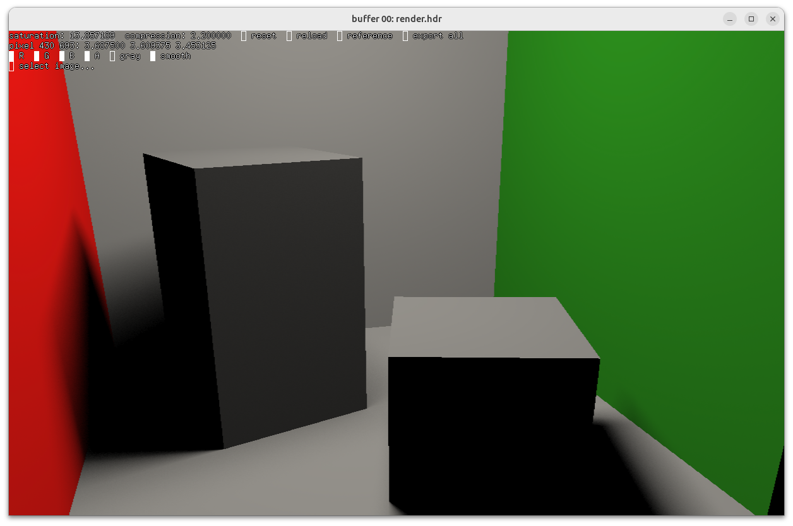

# Rapport du projet lancer de rayons

## Ressources

[Sources du projet](https://github.com/Hypooxanthine/M2-SI3D-Rasterization/tree/master/TP2_SI3D)

Pour compiler et lancer, depuis le répertoire racine de gkit : 
```shell
premake4 gmake
./run2.sh
```

## Screenshots



## [en cours de rédaction]
