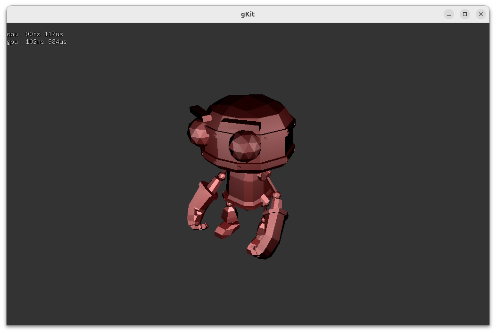
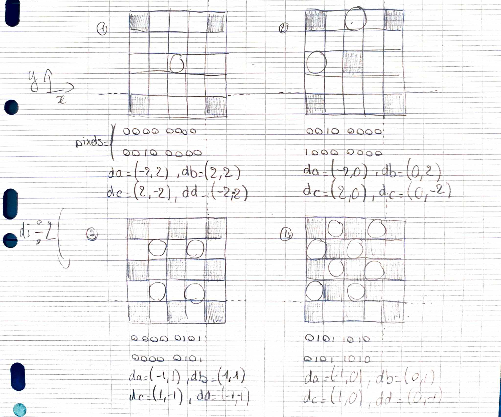
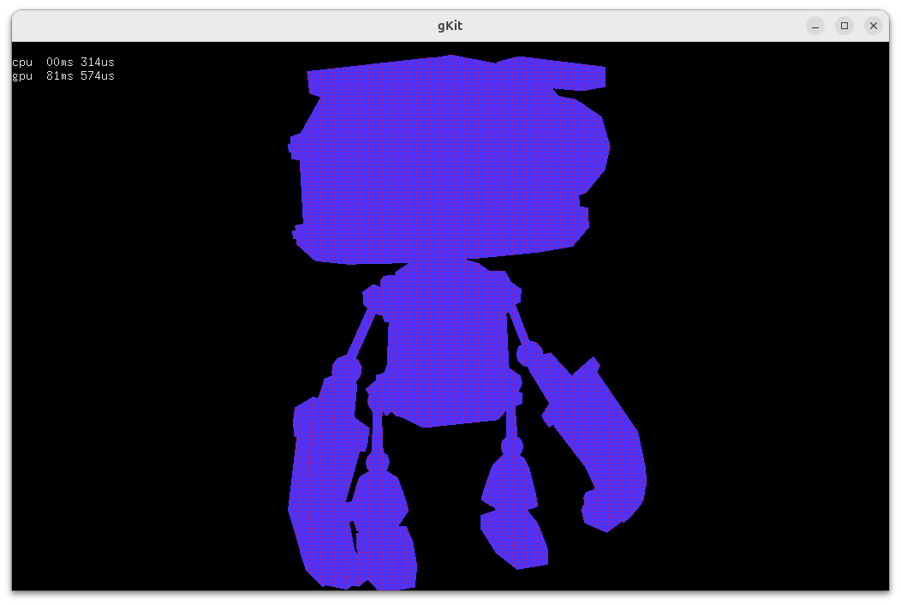
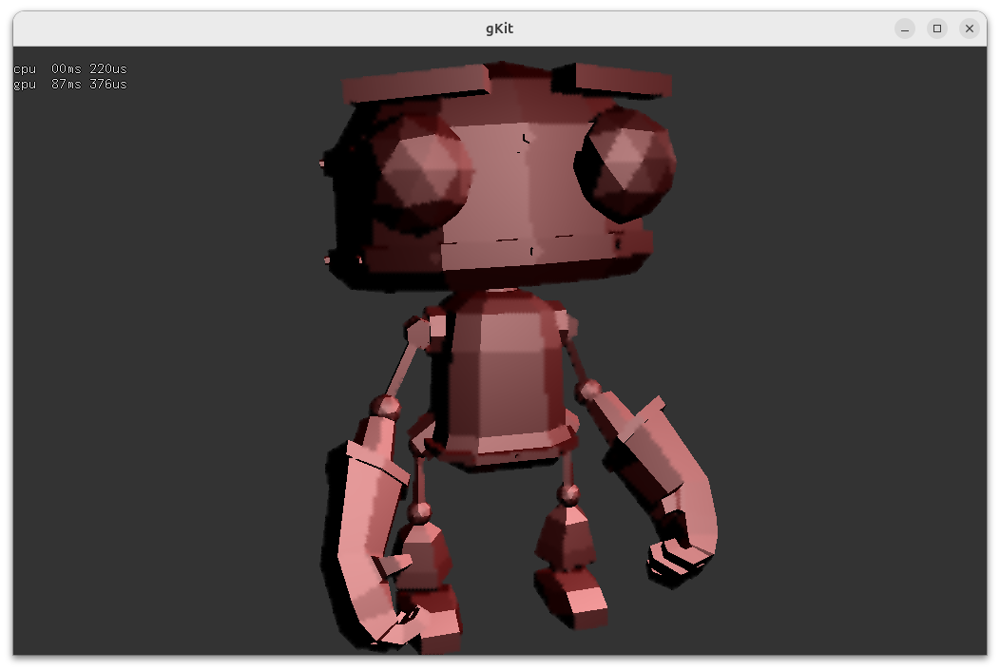
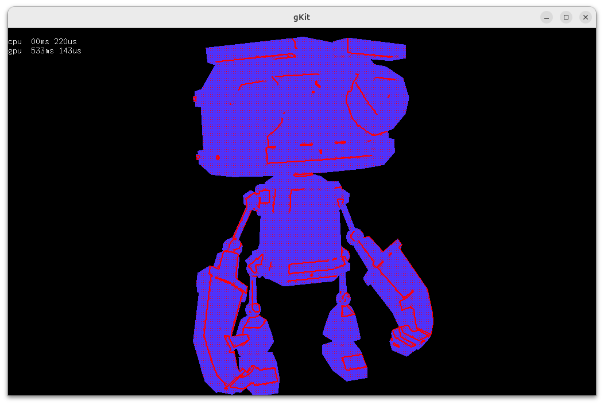
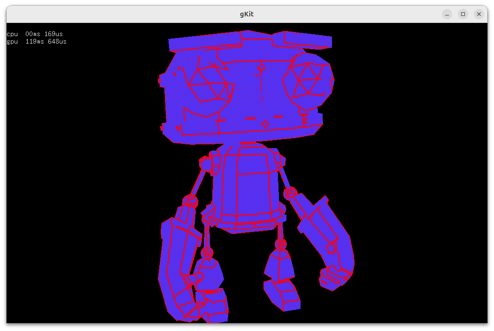

# Rapport du projet Rendu différé et interpolé

## Ressources

[Sources du projet](https://github.com/Hypooxanthine/M2-SI3D-Rasterization/tree/master/TP_CG)

[D'autres fichiers source que j'ai créés, communs à tous les projets SI3D / CG](https://github.com/Hypooxanthine/M2-SI3D-Rasterization/tree/master/src/MyThings)

Pour compiler et lancer, depuis le répertoire racine de gkit : 
```shell
premake4 gmake
./run3.sh
```

## Contrôles

- La touche T permet d'alterner entre calcul de tous les pixels et interpolation de certains pixels (selon la méthode décrite dans le sujet du TP).
- La touche D permet d'alterner entre l'affichage de l'objet et l'affichage des pixels calculés (rouges) / interpolés (bleus). Ne fonctionne qu'en mode interpolation.
- Les touches M(oins) et P(lus) permettent de diminuer et d'augmenter le seuil de variance pour l'interpolation. En mode D, on peut voir les zones de grande variation s'allumer progressivement en appuyant sur M.

## Abstraction

Comme pour mon projet de OpenGL (dans le même dépôt Git), j'ai utilisé certaines de mes classes d'abstraction, notamment pour les [compute shaders](https://github.com/Hypooxanthine/M2-SI3D-Rasterization/blob/master/src/MyThings/ComputeShader.h) et les [frame buffers](https://github.com/Hypooxanthine/M2-SI3D-Rasterization/blob/master/src/MyThings/FrameBuffer.h). Le code spécifique au compute shader n'est pas extrêmement utile au final, le plus utile était pour ce qui touche aux uniforms et aux texture uniforms ( hérité de la classe [Shader](https://github.com/Hypooxanthine/M2-SI3D-Rasterization/blob/master/src/MyThings/Shader.h)).

## Construction du GBuffer

### Rappel du cours

Le GBuffer est un lieu de stockage des informations minimales nécessaires au calcul de la couleur de chaque pixel. Pour chaque pixel, on va avoir besoin de stocker différentes informations relatives au fragment dont le pixel est issu. Dans mon cas, je stocke :
- Un id de matériau (si j'ai une scène avec des objets dont je voudrais calculer une couleur selon différents modèles d'ombrage)
- La position du fragment en World Space
- La normale du fragment
- L'albedo (couleur de base) du fragment
- La valeur de metallique du fragment
- La valeur de diffusion du fragment
- La valeur de brillance du fragmentcomposante

Les dernières valeurs servent au calcul d'un simple Blinn-Phong.

Le GBuffer est matérialisé par une série de textures, qui est un stockage très commode quand on cherche à stocker des informations relatives aux pixels d'une image.

### Côté carte graphique

J'ai un [shader](https://github.com/Hypooxanthine/M2-SI3D-Rasterization/blob/master/TP_CG/shaders/gshader.glsl) spécialisé dans la construction du gbuffer.

Il est assez simple : le vertex shader envoie des informations "habituelles" à savoir, l'interpolation de la position et de la normale du fragment.

Le fragment shader va remplir le GBuffer. Pour ce qui est des valeurs du modèle d'ombrage, je les ai écrites en dur dans le shader, mais on pourrait imaginer qu'ils viennent d'une albedo map, metalness map, diffuse map, shininess map.

Pour le "remplissage" du GBuffer, il s'agit de la partie la plus difficile de l'étape. Ici, dans le fragment shader, on utilise de multiples sorties, correspondant aux valeurs du GBuffer. Mais ces sorties doivent êtres paramétrées.

### Côté application

Pour paramétrer les multiples sorties du fragment shader, j'ai dû créer un frame buffer "gFrameBuffer" auquel j'ajoute des GL_COLOR_ATTACHMENTi où i va de 0 à 3. Chaque valeur du GBuffer fait l'objet d'une texture, sauf pour la position et le matid que j'ai mutualisés en une texture 4 canaux. Finalement, chacune de ces textures correspond à la sortie i dans le fragment shader.

Dans la boucle de rendu, je fais un bind du frame buffer, j'affecte mes uniforms de transformation habituels, et je fais mes draws. Ici, je dessine un simple robot, mais on pourrait faire plusieurs draws différents si on voulait, tout ce qui nous intéresse à la fin de cette étape est les informations pour chaque pixel du fragment ayant la plus faible profondeur après rastérisation pas la carte graphique.

### Captures d'écran



On a un rendu comme avec la pipeline standard, sans artefact. Cependant, les calculs de Blinn-Phong n'ont été faits qu'une seule fois par pixel du robot.

## Interpolation des pixels

### Abstraction

Maintenant, on peut travailler sur l'interpolation des couleurs.

La première passe calcule 1 pixel sur 4 dans les deux dimensions (donc 1 pixel sur 16), et a son propre compute shader.

La seconde passe est subdivisée en 4 sous-passes et a son propre unique compute shader également.



Ce schéma montre la seconde passe. Au début, on a déjà 1 pixel sur 16 dont on connait la couleur.

Ensuite, pour chaque pixel, on définit des parents, et on calcule la variance (dans mon TP, elle se base sur la couleur). Si la variance dépasse un certain seuil, on recalcule le pixel. Sinon, on interpole la couleur des parents.

Les cases noires correspondent à un pixel dont on connait la couleur. Les cases entourées correspondent à un pixel dont on cherche la couleur (soit par interpolation, soit par le calcul). On observe que peu importe la sous-passe, un pixel dont on cherche la couleur a 4 parents. On observe également que dans une même sous-passe, si on a plusieurs pixels dont on cherche la couleur, les parents de ces pixels ont des positions relatives identiques pour tous les pixels entourés (= dont on cherche la couleur).

On peut donc utiliser des variables pour toutes ces valeurs. On aura donc 4 variables vec2 qui donneront, pour chaque pixel dont on veut attribuer la couleur, la position relative des parents.

Il faut également une variable contenant l'information des pixels dont on cherche la couleur. Pour cela, on observe dans le schéma que les pixels dont on cherche la couleur sont tous contenus dans la sous-grille 4x4 en haut à gauche de la grille 5x5 (pointillés sur les schémas montrant la grille 4x4 à chaque sous-passe). On a donc 16 pixels possibles, et on passera sur chacun d'entre eux sauf celui en haut à gauche (couleur déjà calculée en première passe). J'ai donc choisi d'utiliser de coder l'information sur 2 octets, où chaque bit correspond à 1 si le pixel correspondant doit se faire attribuer une couleur, et à 0 sinon.

### Côté application

Avant la boucle de rendu, j'écris les valeurs des 4 vecteurs pour les 4 sous-passes (16 vecteurs au total). Je génère également deux frame buffers : un intermédiaire, qui va juste être un lien vers la texture en cours d'écriture par les compute shaders, et un pour le debug, qui permet l'affichage des pixels rouges/bleus pour les pixels calculés/interpolés. Le frame buffer intermédiaire servira à la fin à faire un glBlitFrameBuffers sur le frame buffer par défaut (0).

Pour le rendu, puisque je voulais pouvoir activer le mode interpolation ou non, j'ai une branche qui va utiliser [un shader](https://github.com/Hypooxanthine/M2-SI3D-Rasterization/blob/master/TP_CG/shaders/full_colors.glsl) qui calcule tous les pixels comme d'habitude.

Concernant le mode interpolation, il y a un premier dispatch pour la première passe, puis 4 dispatches pour la seconde passe. On peut voir les tableaux de bits passés en uniform. A noter que j'ai inversé les bits entre le schéma et le fichier c++, car je passe un nombre sur 4 octets alors que je n'ai besoin que de 2 octets, et donc je ne voulais pas un padding de 16 bits à gauche, il était donc plus simple d'inverser les bits.

### Côté carte graphique

#### Première passe

[Ce shader](https://github.com/Hypooxanthine/M2-SI3D-Rasterization/blob/master/TP_CG/shaders/first_pass_colors.glsl) est utilisé.

La taille des groupes est 8x8x1. Ainsi, pour le dispatch, je divise les dimensions de la fenêtre d'abord par 8, puis par 4 : je veux traiter 1 pixel sur 4 dans les deux dimensions.

Le shader va ensuite calculer directement le pixel en haut à gauche de chaque tuile 4x4. Je ne commente pas la fonction de shading car ce n'est pas l'objet du TP. Cette fonction sera retrouvée à l'identique dans le shader suivant.

#### Seconde passe

[Ce shader](https://github.com/Hypooxanthine/M2-SI3D-Rasterization/blob/master/TP_CG/shaders/second_pass_colors.glsl) est utilisé.

On retrouve les uniforms déjà abordés, notamment les 4 vec2, le tableau de bits (fillMask), et le seuil de variance.

Le nombre de groups et de threads sera le même qu'en première passe. On va donc considérer dans le shader, encore une fois, une des tuiles 4x4 formant l'image. Puis on va boucler de 0 à 15 (pixels de la tuile), et faire une vérification sur le tableau de bits : si on a un 1 au bit correspondant, on interpole/calcule, sinon, on ne fait rien.

Une fonction donne la variance en fonction de la couleur des voisins (à noter: un "voisin" est un des 4 pixels positionné comme le pixel courant + un des 4 vecteurs évoqués avant). On aurait aussi pu utiliser d'autres valeurs en concomitance, comme la position, la profondeur par exemple. Lorsque la variance est faible (inférieure au seuil), on va simplement interpoler la couleur des 4 voisins, ce qui est assez rapide. Dans le cas contraire, on va recalculer la couleur, de la même manière que dans la première passe.

### Résultats

<figure>
  
  <figcaption>Seuil de variance de 0.1</figcaption>
</figure>

<figure>
  
  <figcaption>Seuil de variance de 0.1</figcaption>
</figure>

<figure>
  
  <figcaption>Seuil de variance de 0.01</figcaption>
</figure>

<figure>
  
  <figcaption>Seuil de variance de 0.01</figcaption>
</figure>

<figure>
  
  <figcaption>Seuil de variance de 0.001</figcaption>
</figure>

<figure>
  
  <figcaption>Seuil de variance de 0.001</figcaption>
</figure>
